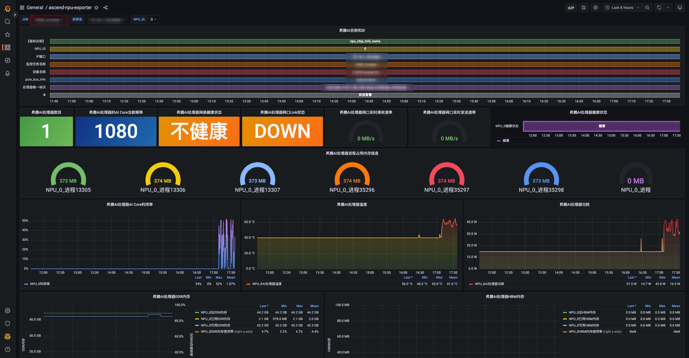

# ascend-npu-dashboard
Grafana Dashboard for Monitoring Ascend NPU Exporter,适用于ascend-npu-exporter监控昇腾AI处理器的Grafana Dashboard
## 1.简介
采用[ascend-npu-exporter](https://github.com/Ascend/ascend-npu-exporter)二进制启动方式监控昇腾AI处理器，数据存储在prometheus中，可下载该面板通过Grafana展示。
## 2.涉及指标
| 指标名 |
| ---  |
|  昇腾AI处理器数目 |
|  昇腾AI处理器的AI Core当前频率 |
|  昇腾AI处理器网络健康状态 （仅支持Atlas 训练系列产品|
|  昇腾AI处理器网口Link状态 （仅支持Atlas 训练系列产品|
|  昇腾AI处理器网口实时接收速率（仅支持Atlas 训练系列产品） |
|  昇腾AI处理器网口实时发送速率 （仅支持Atlas 训练系列产品）|
|  昇腾AI处理器持续健康状态 |
|  昇腾AI处理器的进程的信息，取值为进程使用的内存 |
|  昇腾AI处理器AI Core利用率 |
|  昇腾AI处理器温度 |
|  昇腾AI处理器功耗（910和310为处理器功耗，310P为板卡功耗） |
|  昇腾AI处理器DDR内存已使用信息|
|  昇腾AI处理器HBM内存总信息|

详细指标参见[NPU-Exporter Prometheus Metrics](https://www.hiascend.com/document/detail/zh/mindx-dl/50rc2/clusterscheduling/clusterscheduling/dlug_guide_03_000138.html)接口
## 3.截图示例
